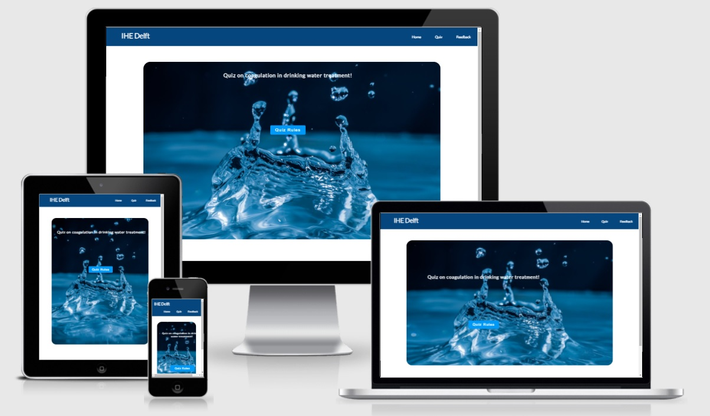
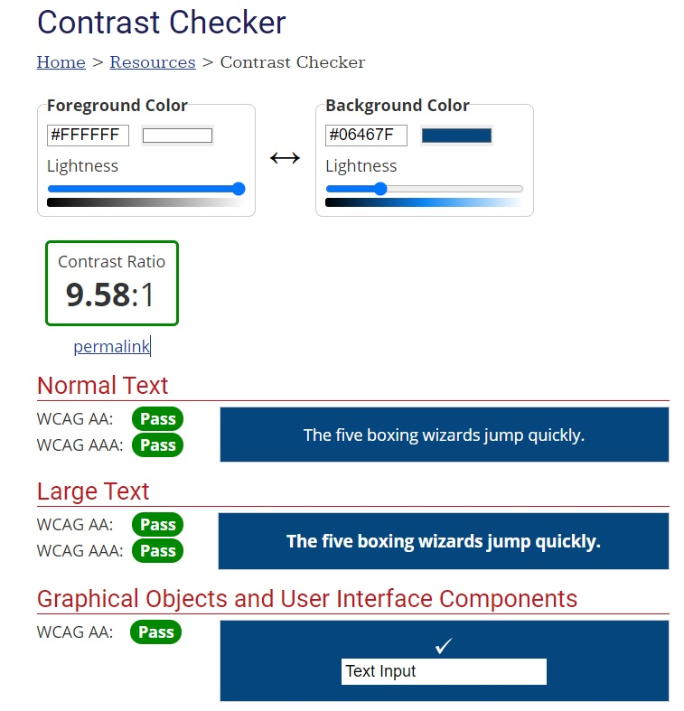
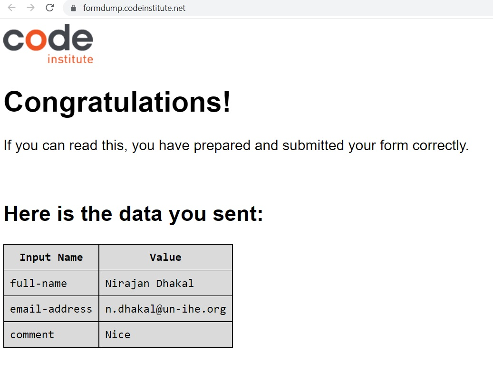
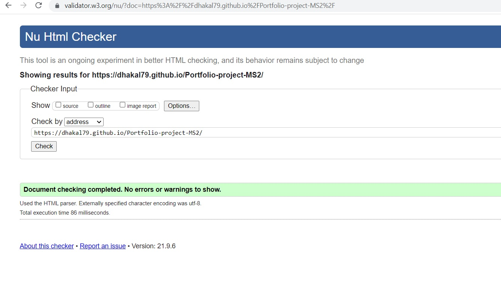

# Quiz on Coagulation in Water Treatment 
Welcome! [IHE Delft](http://un-ihe.org)
## Introduction
Globally, degradation of surface water quality due to the presence of physical, chemical and biological impurities is a major issue that makes surface water unsafe to drink. Therefore, treatment of surface water is essential to make it pathogen free, chemically safe, with no dirt solid matter and aesthetically acceptable. In this context, there is a strong need to understand the theoretical aspect of various treatment options, its design principle and operation. Among the various treatment steps, coagulation process is the first steps in the treatment where we add coagulant to agglomerate small particles to larger in order to allow them to settle in the next treatment steps. 

The overall aim of this project is to make quiz app which allows to assess the knowledge of students in the topic of coagulation. This project is the continuation of the first project, which focused on giving theoretical content about the topic. 

A live website can be found [here](https://dhakal79.github.io/Portfolio-project-MS2/).

## Table of Contents 

# Table of Contents
 [1. User Expereince (UX) design](#ux)
  - [User Goals:](#user-goals)
  - [User Expectations:](#user-expectations)
  -	[Colour scheme and font](#color-scheme)
  - [Site skeleton (wireframes)-3 pages](#wireframes)
    - [Home page](#home-page)
    - [Quiz page](#quiz-page)
    - [Feedback page](#feedback-page)

      
  [2. Features](#features)

  [3.Technologies used](#technologies-used)

  [4.Testing](#testing)

  [5.Bugs](#bugs)

  [6. Deployment](#deployment)

  [7. Acknowledgement](#acknowledgement)

  
# 1. User Expereince (UX) design
  [Go to the top](#table-of-contents)

  Due to COVID-19, the university is switcing all educatiuon systems online which includes teaching and student assessment as well. One of the challenges for lecturer is to assess and grade the knowledge of students online. This project is aimed to design the online quiz app which allows to assess the knowledge of students on the topic coagulation in drinking water treatment. 

  The following users types can be benifitted from the website:

* Professionals dealing with water supply engineering.
* Post graduate students in the field of water supply and environmental engineering. 
 
 

## 1.1 User Goals
  [Go to the top](#table-of-contents)

The main goal of this project is to develop a quiz app that allows to assess the knowldge of students in the topic of coagulation in drinking water treatment process. This is of great useful for me to apply in my teaching to assess the understanding of my students.

## 1.2 User Expectations
  [Go to the top](#table-of-contents)

The quiz app provides 15 multiple choice questions that allows the users to understanding their knowledge on topic "coagulation in drinking water treatment process". Folloiwng user's expections are considered while designing the site:
* The quiz app is designed considering the expectation of users to be simple and easy to use.
* The user interface is easy to navigate (inlcude main navigation bar, and a link at front page that direct to quiz page in just one click).
* Quiz app that contains bank of questions with multiple choice options but users can only select one answer.
* Quiz app has timer that alerts users to finish the quiz on time.
* Quiz app has the function to show if the selected answer is correct or wrong and provide the score (correct and incorrect) at the bottom.
* Quiz app provides overall score with feedback message at the end of the quiz and has an option to try again the quiz.
* Responsive design for all screen/device sizes like mobile, tablet and desktop.
* Feedback page provided where users can provide their comments and suggestion for future improvement

## 1.3 Color Scheme
  [Go to the top](#table-of-contents)

The choice of website right foreground and background colour is essential that decides the site visitors wheather to emote the site or not. In this design we consider the accessibility guideline i.e, contrast between background and foreground colours. We make use of [WebAim](https://webaim.org/resources/contrastchecker/)  to select the background and foreground color. Here is an example how the choice of background and foreground is decided to the site.

## 1.5 Site Skeleton
  [Go to the top](#table-of-contents)
 
[Balsamiq](https://balsamiq.com/) was used to create wireframes of the website. This was very useful as it gives the template of the UI. Wireframes were designed for web browser and a mobile browser format. The concept design (wireframes) of webpages (3 pages) of the app prepared is presented below.

### Home Page

	

### Quiz Page
  

### Feedback Page

  
# 2. Features
  [Go to the top](#table-of-contents)
 ### All 3 pages:
- Navigation bar is placed at the top right corner of the page, and cosnidered a hover effect that changes the colour (with green box) when we want to click the page. The hover effect is placed to improve the user expereince. 
- Logo of IHE Delft is placed on the top left corner 
- Background color of menu bar and foreground color were chosen considering the contrast between background and foreground colours. We make use of [WebAim](https://webaim.org/resources/contrastchecker/) to select the background and foreground color.
- Social media links (for facebook, Linkden, Twitter and Youtube) are placed at the bottom of the each page in the footer. All the links will open in a new tab. 
- At the bottom of each it is written By Nirajan Dhakal, 2021 

### Home page:
- An image of water treatment plant with zoom animation is included with a focus to attract the attention of the user.
- A text box with letter "Quiz on coagulation in water treatment is provided. This has animation per character to atrract the attention of the user.
- Below the text, a button "go to quiz" is given to direct the user to the quiz page.

The screenshot of home page is below:

  Introduction page UI:
  

### Quiz page:
- This page start with title "Quiz on coagulation in drinking water treatment" and a button 'Quiz rule". The screenshot is below:

- On clicking button "Quiz rule" it provides instruction to the quiz and "start quiz" button. The screenshot is below:

- On clicking to start quiz button, the page is provided with a page that contains question banks.The page has question with 3 to 4 options to select answer. On top of page timer is provided to alert the user the remaining time to finish the quiz. The page also has next button, which will be active once answer option is selected. Once the user click the next button, the next question will appear until it reach to question 15. At the bottom of the page there is an option to provides the number of correct and incorrect answers given by the user.

- After completing 15 questions, a score box will appear that will highlight the 3 message to the users depending upon how many answers are correct i.e., i) >13 out of 15 ii) >=7 and iii)<7
- the score box has a try again button which will redirect the user to question bank 1. At this stage the timer is set again back to 200 second.

### Feedback page:
- Include contact form that provides the user the ability to provide comments and feedback about the quiz. 
-Provide Submit and Reset buttons with hoever effect on it
- The form use the method="POST" action="https://formdump.codeinstitute.net/"
- I use the option of placeholder for full name and email address.
- If the user tries to submit the form without any message a pop up will appear to alert user to provide feedback.

The screenshot of feedback page is below:

  Feedback page UI:
  

The feedback form was correctly submitted  as  shown below.

   
# 3. Technologies Used
  [Go to the top](#table-of-contents)

* [HTML5](https://en.wikipedia.org/wiki/HTML5) (markup language) was used for structuring and presenting content of the website.
 
* [CSS3](https://en.wikipedia.org/wiki/CSS) (Cascading Style Sheets) was used to provide the style to the content written in a HTML.
* [JavaScript](https://en.wikipedia.org/wiki/JavaScript) was used to make the developed quiz more interactive, add dynamic behavior and special effects.
* [Balsamiq](https://balsamiq.com/) was used to create wireframes of the website (desktop and mobile version).
* [Google Fonts](https://fonts.google.com/) was used to import font-family "Lato" and "Oswald" into style,css file and which was used throughout the pages of the website.
* [Font Awesome](https://fontawesome.com/) was used to improt icons to the sites.
* [Chrome](https://www.google.com/intl/en_uk/chrome/) was used to debug and test the source code using HTML5 as well as to test site responsiveness.
* [Github](https://github.com/) was used to create the repository and to store the cproject's code after pushed from Git.
* [Gitpod](https://www.gitpod.io/) was used as the Code Editor for the site

* [WebAim](https://webaim.org/resources/contrastchecker/) was used to select the background and font color in the website.
* [W3C Markup](https://validator.w3.org/) tool was used to validate the HTML code  used in the proejct.
* [Jigsaw validation](https://jigsaw.w3.org/) tool was used to validate CSS style used in the proejct.
* [Jshint validation](https://jshint.com/) was used to validate JavaScript code used in the proejct.
* [Ami](http://ami.responsivedesign.is/#) was used to develop a Mockup screenshot generator

  
# 4. Testing
  [Go to the top](#table-of-contents)
## 4.1 Testing using tools
### 4.1.1 Google Developer Tools
Google developer tools (Chrome DevTools) was used as debugging tools. Every elements that was added in HTML CSS style and Javascript was inspected and debugged until I was happy with. Once satisfied, the code was copied from Chrome DevTools and paste in the CSS style sheet.

### 4.1.2 Responsive Tools

In order to make sure that design web pages are responsive to all device sizes, [Am I Responsive](http://ami.responsivedesign.is/) site was used to check it. 

### 4.1.3 W3C Validator Tools

[W3C Markup](https://validator.w3.org/#validate_by_input+with_options) was used to check for any errors within my HTML pages.

The HTML checker notified me an error in my quiz.html page such as;
- Consider using the h1 element as a top-level heading only (all h1 elements)
- Section lacks heading, consider using h2-h6 elements

The HTML checker also notified me an error in my contact.html page such as;
- Attribute type not allowed on element textarea at this point.

The identified errors in both pages were corrected by inspecting in ChromeDevTools.

[W3C CSS Validation](https://jigsaw.w3.org/css-validator/) was used to check for any error within my CSS stylesheet. It identified Parse Error which was corrected by identified an issue in the css style sheet. It was found that there was missing curlie bracket. After adding curlie bracket, no errors were found.

[Jshint validation](https://jshint.com/) was used to validate JavaScript code used in the proejct.
It identified several errors such as;
- missing semicolons in many lines
- warning saying "const' is available in ES6 (use 'esversion: 6') or Mozilla JS extensions (use moz)"

The identified errors due the missing semicolon was corrected by adding semicolon in the JS code. While, the warning about available Es6 was corrected by clicking cofigure button on top right corner of Jshint and ticking "New JavaScript features (ES6)".

## 4.2 Manual Testing

I have tested my site on multiple devices. These include:
  - Galaxy S5 (360 x 640)
  - iPhone 6/7/8 (375 x 667) 
  - iPhone 6/7/8 plus (414 x 736)
  - ipad (768 x 1024)
  - iPhone XS Max
  - iPad Pro (1024 x 1366)
  - Huawei P20 Pro
  - HP laptop (1980 x1080)

Please find below my testing process for all pages via mobile and web:
 ## All 3 pages:
 ### Navigation bars

TEST            | OUTCOME                          | PASS / FAIL  
--------------- | -------------------------------- | ---------------
Home page | on click to "Home", the browser redirects me to the home page. The hoever effect (green rectangular box) appears when mouse is on "home".| PASS
Quiz page | on click to "quiz", the browser redirects me to the quiz page. The hoever effect (green rectangular box) appears when mouse is on "quiz". | PASS
Feedback page| on click to "feedback page", the browser redirects me to the feedback page. The hoever effect (green rectangular box) appears when mouse is on "feedback page". | PASS
Responsive | All pages and elements were responsive (mobile and website) using differnt breakpoints.| PASS
Foreground & background  color| Checked foreground information is not distracted by backgrounds| PASS
Text|Checked if all fonts and colors used are consistent or not|PASS

 ### Footer
TEST            | OUTCOME                          | PASS / FAIL  
--------------- | -------------------------------- | ---------------
Facebook | on clicking Facebook icon, a new tab opens and redirects to the Facebook website.| PASS
Linkedin| on clicking Linkedin icon, a new tab opens and redirects to the Linkdin website.  | PASS
Instagram| on clicking instagram icon, a new tab opens and redirects to the instagram website.  | PASS
Youtube| on clicking youtube icon, a new tab opens and redirects to the youtube we

### Home page
TEST            | OUTCOME                          | PASS / FAIL  
--------------- | -------------------------------- | ---------------
Animation effect| The zoom animation effect on hero image appread when "home" was clicked. Image was checked if blurred in differnt screen sizes| PASS
Animation character| The animation of the each charater of the headline and highlight in differnt color was checked|PASS
Responsive | Responsive of the page in differnce screen sizes (mobile and website) using differnt breakpoints were checked.| PASS
Go-to-Quiz tab | Checked if after clicking the go-to-quiz redirect to the quiz page or not| PASS
Accessibility | Checked the accessibility of the page using lighthouse| PASS

### Quiz page
TEST            | OUTCOME                          | PASS / FAIL  
--------------- | -------------------------------- | ---------------
Quiz Rule button| Checked when clicked quiz rule button, quiz instruction box apprears or not| PASS
Start quiz button| Checked when clicked start quiz button, question box apprears or not| PASS
Hiding of instruction box|Checked when clicked start quiz button, instruction box disappears or not| PASS
Next button| Checked if next button is disabled or not if answer option is not selected and vise versa| PASS
Hiding of previous questions box| Checked when clicked with next button, the previous question box dissapear or not|PASS
Score card|Checked if the score increases once answer option is selected| PASS
Final assessment message|Checked when clicked next button of final questions, final score card with message apprear or not|PASS
Try again|Checked when clicked try again button, it will redirect to first question or not| PASS
Timer|Checked if timer is displaying correctly or not and when clicked to try again button if it is reset to original 200 sec or not|PASS
Responsive | Responsive of the page in differnce screen sizes (mobile and website) using differnt breakpoints were checked.| PASS
Accessibility | Checked the accessibility of the page using lighthouse| PASS

### Feedback page
TEST            | OUTCOME                          | PASS / FAIL  
--------------- | -------------------------------- | ---------------
Responsive | Responsive of the page in differnce screen sizes (mobile and website) using differnt breakpoints were checked.| PASS
Submit/Reset| Checked if submit and reset button works or not|PASS
Placeholder| Checked if placeholder on the full name, email addres and text box works or not|PASS
Accessibility | Checked the accessibility of the page using lighthouse| PASS

  
# 5. Bugs
  [Go to the top](#table-of-contents)

### Solved bugs
- I found answer box was fixed for 4 options and when a question has only 3 options, the last box was written with undefined. I solved this issue by adding below code in javascript const lastAns in line 147

- I found timer did not start from 200 sec after clicking start quiz button. I solved this by adding a code timeSecond = 200; in startQuiz function. Similar issue was see when restart the quiz, the time did not start with 200 sec. This was solved by add in a code timeSecond = 200; in restartButton function. 

- I discovered missing semicolon in several lines of javascript code which was solved after validation with Jshint.
- Initial gap was seen in the placeholder text in feedback page, which was solved by brining the closing tag of textarea in the same line.
- I discoved missing semicolon after &nbsp, which was used to create a space between correct/incorrect answer and score.
- I discoved the animation of character in the index page was not working and figured it out by playing with setInterval in javascript code.

  
# 6. Deployment
  [Go to the top](#table-of-contents)

The site was deployed to GitHub pages using the following steps:
- Sign up to GutHub
- Create a new repository on GitHub.
- Click on settings on the navigation bar under the repository title.
- Select pages on the left menu bar.
- Click on the master branch and save.
- This will now generate a link with your website live.
- The live link can be found here - (https://dhakal79.github.io/Portfolio-project-MS2/)

  
# 7. Acknowledgement
  [Go to the top](#table-of-contents)
### Code
* The footer code came from the Love Running projects (taken from my first project)
* The code for image animation on index.html page taken from youtube video projects https://www.youtube.com/watch?v=AKmoccuRiN4
* Coding for feedback.html page was inspired from differnt tutorial from https://codeinstitute.net/ 
* Quiz page design, some css style and javascript code was inspired/taken  from https://github.com/jas-sin82/milestone-project-2 found in google search and modified.
* The icons in the footer and contact page came from [Font Awesome](https://fontawesome.com/)
* For README.md file, reference from my first project was considered. 
* Thanks to my mentor Marcel Mulders for his constructive feedback.

### Content 
 * Some of the quiz questions were taken from https://ocw.tudelft.nl/course-exercises/test-coagulation-and-flocculation/
 * Images were taken from [Google Images](https://www.google.com/imghp?hl=en)
  