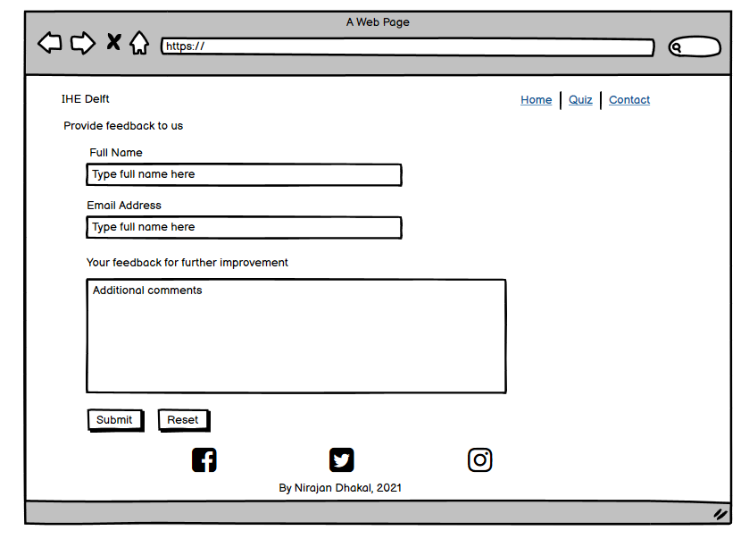
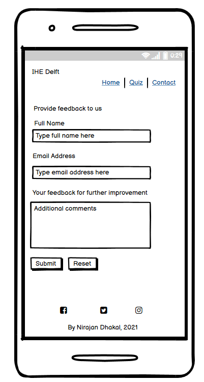

# Unit Operation in Water Treatment 
Welcome! [IHE Delft](http://un-ihe.org)
## Introduction
IHE Delft Institute for Water Education is the largest international water education facility in the world. Its mission is to contribute to water related research and the education of water professionals. IHE Delft has provided graduate education to more than 15,000 water professionals from 162 countries. Over 150 PhD fellows are currently enrolled in water-related research and more than 120 water research and capacity development projects are carried out throughout the world. Due to COVID-19, IHE Delft is making education online if possible for all the modules. Within this new policy framework, I am going to make my module"unit operation in water treatment" online. This module has four componets coagulation, sedimentation, filtration and dissolved air floatation. 

The overall aim of this project is to make online the componennt "coagulation" which I involve for teaching. 

A live website can be found [here](https://dhakal79.github.io/Portfolio-project-MS1/).

## Table of Contents 

# Table of Contents
 [1. User Expereince (UX) design](#ux)
  - [User Goals:](#user-goals)
  - [User Expectations:](#user-expectations)
  -	[Colour scheme and font](#color-scheme)
  - [Audio/video controls](#audio-video)
  - [Site skeleton (wireframes)-3 pages](#wireframes)
    - [Introduction page](#introduction-page)
    - [Theory page](#theory-page)
    - [Feedback page](#feedback-page)

      
  [2. Features](#features)

  [3.Technologies used](#technologies-used)

  [4.Testing](#testing)

  [5.Bugs](#bugs)

  [6. Deployment](#deployment)

  [7. Acknowledgement](#acknowledgement)

  
# 1. User Expereince (UX) design
  [Go to the top](#table-of-contents)

  The impact of COVID-19 pandemic on university teaching is to turn face to face teaching to online learning. It was a challenge for lecturer to switch all face to face teaching to online learning. This project is aimed to provide a platform where students can learn online for a module name" 
  unit operation in water treatment". 

  The following users types can be benifitted from the website:

* Professionals dealing with engineering, management and education in the fields of water supply and wastewater and urban infrastructure.
* Post graduate students in environmental engineering. 
* Participants from government organisations ( both local and national agencies), non-governmental organisations and the private sector. 
 

## 1.1 User Goals
  [Go to the top](#table-of-contents)

The main goal of this website is to provide in depth theory about coagulation process in drinking water treatment. I want to provide information about coagulation to the target audience.

## 1.2 User Expectations
  [Go to the top](#table-of-contents)

The website content provides state-of-the-art knowledge and experience on the technologies and design practices of conventional water treatment systems. The site can be an ideal for practicing engineers who are working in the water supply and sewerage systems. Folloiwng user's expections are considered while designing the site:
* The site structure is designed considering the expectation of users to be simple and easy to use.
* The user interface is easy to navigate (inlcude main navigation bar, drop dwon menu bar and a link at bottom of page that user can go back to top of the page in just one click).
* Responsive design for all screen/device sizes like mobile, tablet and desktop.
* Feedback/course evalaution page provided where users can provide their comments and suggestion for future improvement
* a link for application provided for those users who will be interested to take this course faceto face at IHE Delft.

## 1.3 Color Scheme
  [Go to the top](#table-of-contents)

The choice of website right foreground and background colour is essential that decides the site visitors wheather to emote the site or not. In this design we consider the accessibility guideline i.e, contrast between background and foreground colours. We make use of [WebAim](https://webaim.org/resources/contrastchecker/)  to select the background and foreground color. Here is an example how the choice of background and foreground is decided to the site.

Other foreground and background color used in the sites are
* foreground: #ffffff
* background: #044348

## 1.4 Audio-Video/Images
  [Go to the top](#table-of-contents)
  
This website consider of having images, audio/video that helps the users to understand the content easily. Having picture, audio/video consider worth a thousand words” when creating a web application. As far as possible all the images, video included in the website, is considered to be of high quality. The included audio/video is provided with control actions such as playing of audio/video that allows the user to initiate and control the actions.

## 1.5 Site Skeleton
  [Go to the top](#table-of-contents)
 
[Balsamiq](https://balsamiq.com/) was used to create wireframes of the website. This was very useful as it gives the template of the UI. Wireframes were designed for web browser and a mobile browser format. The concept design (wireframes) of webpages (3 pages) prepared is presented below.

### Introduction Page

	

### Theory Page
  

### Feedback Page

  
# 2. Features
  [Go to the top](#table-of-contents)
 ### All 3 pages:
- Navigation bar is placed at the top right corner of the page, and cosnidered a hover effect that changes the colour (with green box) when we want to click the page. The hover effect is placed to improve the user expereince. 
- Drop down menu bar is provided to the main menu bar of the theory.html page
- Logo of IHE Delft is placed on the top left corner 
- Background color of menu bar and foreground color were chosen considering the contrast between background and foreground colours. We make use of [WebAim](https://webaim.org/resources/contrastchecker/) to select the background and foreground color.
- Social media links (for facebook, Linkden, Twitter and Youtube) are placed at the bottom of the each page in the footer. All the links will open in a new tab. 
- Back to top link provided to each page at the bottom left corner. this will allow the visitor to access to the top oif page in one click.

### Introduction page:
- Water image is included just below the menubar to highlight that this website provides information about water. We provide zoom animation to the image to attract the attention of the user.
- The page contain the title of the module "Unit Operation in Water Treatment" and below which which provided this divisions (using flex properties). The first division (left) provides information about aim of the module, learning objectives, the second division (middle) provides information about when to apply for the course and contact details of the module coordinator. finally, the last division contain a module introduction video (self recorded). 
- An external link "Apply here" provided where interested users can apply for a face to face course.
- Summary of topics to be covered in this module is presented in the bottom of the page (just above the social media link) using the property flex.

The screenshot of introduction page is below:

  Introduction page UI:
  

### Theory page:
- This page provides theory of coagulation process in water treatment
- page provides information in both text as well as graphs.
- This page also provides the Table of content that helps users what topics needs to be covered in this course

The screenshot of theory page is below:

 Theory page UI:
  

### Feedback page:
- Include contact form that provides the user the ability to message site owner, provide feedback and suggestions. 
- Inlcude module evaluation forms where users can choose the options from (strongly agree, agree, neutral, disagree, strongly disagree) using radio-button option.
- Provide Submit and Reset buttons with hoever effect on it
- The form use the method="POST" action="https://formdump.codeinstitute.net/"
- I use the option of placeholder for full name and email address.

The screenshot of feedback page is below:

  Feedback page UI:
  

The feedback form was correctly submitted  as  shown below.

   
# 3. Technologies Used
  [Go to the top](#table-of-contents)

* [HTML5](https://en.wikipedia.org/wiki/HTML5) (markup language) was used for structuring and presenting content of the website.
 
* [CSS3](https://en.wikipedia.org/wiki/CSS) (Cascading Style Sheets) was used to provide the style to the content written in a HTML.
* [Balsamiq](https://balsamiq.com/) was used to create wireframes of the website (desktop and mobile version).
* [Google Fonts](https://fonts.google.com/) was used to import font-family "Lato" and "Oswald" into style,css file and which was used throughout the pages of the website.
* [Adobe Photoshop](https://www.adobe.com/uk/products/photoshop.html) was used to resize some of the site images.
* [Font Awesome](https://fontawesome.com/) was used to improt icons to the sites.
* [Chrome](https://www.google.com/intl/en_uk/chrome/) was used to debug and test the source code using HTML5 as well as to test site responsiveness.
* [Github](https://github.com/) was used to create the repository and to store the cproject's code after pushed from Git.
* [Gitpod](https://www.gitpod.io/) was used as the Code Editor for the site

* [WebAim](https://webaim.org/resources/contrastchecker/) was used to select the background and font color in the website.
* [W3C Markup](https://validator.w3.org/) and [Jigsaw validation](https://jigsaw.w3.org/) tools were used to validate the HTML code and CSS style used in the proejct.
* [Ami](http://ami.responsivedesign.is/#) was used to develop a Mockup screenshot generator
  
# 4. Testing
  [Go to the top](#table-of-contents)
## 4.1 Testing using tools
### 4.1.1 Google Developer Tools
I make use of google developer tools (Chrome DevTools) as debugging tools. Using this tool i inspect for every elements that I added in HTML and CSS style. Once I was happy with, I copy the CSS style code from Chrome DevTools and paste in my CSS style sheet.

### 4.1.2 Responsive Tools

In order to make sure that design web pages are responsive to all device sizes, [Am I Responsive](http://ami.responsivedesign.is/) site was used to check it. 

### 4.1.3 W3C Validator Tools

[W3C Markup](https://validator.w3.org/#validate_by_input+with_options) was used to check for any errors within my HTML pages.

The HTML checker notified me an error in my index.html page. it suggested that i should consider using h2-h6 elements to the section with id='animation" in the page. 

The identified error was corrected by switching section to div and no error was found as shown in picture below.

[W3C CSS Validation](https://jigsaw.w3.org/css-validator/) was used to check for any error within my CSS stylesheet. No errors were found.

## 4.2 Manual Testing

I have tested my site on multiple devices. These include:
  - Galaxy S5 (360 x 640)
  - iPhone 6/7/8 (375 x 667) 
  - iPhone 6/7/8 plus (414 x 736)
  - ipad (768 x 1024)
  - iPhone XS Max
  - iPad Pro (1024 x 1366)
  - Huawei P20 Pro

Please find below my testing process for all pages via mobile and web:
 ## All 3 pages:
 ### Navigation bars

TEST            | OUTCOME                          | PASS / FAIL  
--------------- | -------------------------------- | ---------------
Introduction page | on click to "introduction", the browser redirects me to the introduction page. The hoever effect (green rectangular box) appears when mouse is on "introduction".| PASS
Theory page | on click to drop down menu bar "coagulation", the browser redirects me to the theory page. The hoever effect (green rectangular box) appears when mouse is on "theory". | PASS
Feedback page| on click to "feedback page", the browser redirects me to the feedback page. The hoever effect (green rectangular box) appears when mouse is on "feedback page". | PASS
Responsive | All pages and elements were responsive (mobile and website) using differnt breakpoints.| PASS
Foreground & background  color| Checked foreground information is not distracted by backgrounds| PASS
Text|Checked if all fonts and colors used are consistent or not|PASS
Back to top|Checked if the page redirect to the top of the page when clicking the back to top on the bottom left corner of the page| PASS
|||

 ### Footer
TEST            | OUTCOME                          | PASS / FAIL  
--------------- | -------------------------------- | ---------------
Facebook | on clicking Facebook icon, a new tab opens and redirects to the Facebook website.| PASS
Linkedin| on clicking Linkedin icon, a new tab opens and redirects to the Linkdin website.  | PASS
Instagram| on clicking instagram icon, a new tab opens and redirects to the instagram website.  | PASS
Youtube| on clicking youtube icon, a new tab opens and redirects to the youtube we

### Introduction page
TEST            | OUTCOME                          | PASS / FAIL  
--------------- | -------------------------------- | ---------------
Media| All images and videos on the pages load and played. The video added was not auto play. All images were checked if it blurred in differnt screen sizes| PASS
Responsive | Responsive of the page in differnce screen sizes (mobile and website) using differnt breakpoints were checked.| PASS
External link | Checked if the external link "Apply here" redirect to the concern page and open in new tab.| PASS
Accessibility | Checked the accessibility of the page using lighthouse| PASS

### Theory page
TEST            | OUTCOME                          | PASS / FAIL  
--------------- | -------------------------------- | ---------------
Media| All images on the pages load. All images were checked if it blurred in differnt screen sizes| PASS
Responsive | Responsive of the page in differnce screen sizes (mobile and website) using differnt breakpoints were checked.| PASS
Accessibility | Checked the accessibility of the page using lighthouse| PASS

### Feedback page
TEST            | OUTCOME                          | PASS / FAIL  
--------------- | -------------------------------- | ---------------
Responsive | Responsive of the page in differnce screen sizes (mobile and website) using differnt breakpoints were checked.| PASS
Submit/Reset| Checked if submit and reset button works or not|PASS
Radio buttons| Checked if radio button works or not|PASS
Placeholder| Checked if placeholder on the full name and email addres works or not|PASS
Google map| Checked if google map when clicked on view larger map redirect to the google map page in new tab works ot not|PASS
Accessibility | Checked the accessibility of the page using lighthouse| PASS

  
# 5. Bugs
  [Go to the top](#table-of-contents)

### Solved bugs
- When i checked the accessibility of feedback page i discovered i forget to add title to iframe (google map). I solved it by adding title "google map".
- I also discovered that Form elements do not have associated labels. I solved this by adding assoviated labels. 
- I saw a hyphens between social media icons. The problem with &lt;a &gt; tags. The problem was solved by writing in css style sheet that target &lt;a &gt; using text-decoration: none;

  
# 6. Deployment
  [Go to the top](#table-of-contents)

The site was deployed to GitHub pages using the following steps:
- Sign up to GutHub
- Create a new repository on GitHub.
- Click on settings on the navigation bar under the repository title.
- Select pages on the left menu bar.
- Click on the master branch and save.
- This will now generate a link with your website live.
- The live link can be found here - (https://dhakal79.github.io/Portfolio-project-MS1/)

  
# 7. Acknowledgement
  [Go to the top](#table-of-contents)
### Code
* The footer code came from the Love Running projects
* The code for image animation on index.html page came from the Love Running projects
* Naviagtion drop down menu code came from a youtube video https://www.youtube.com/watch?v=wHFflWvii3M&t=508s
* Coding for feedback.html page was inspired from differnt tutorial from https://codeinstitute.net/ 
* The icons in the footer and contact page came from [Font Awesome](https://fontawesome.com/)
* For README.md file, reference of https://github.com/Chris-McGonigle/emmas-beauty-parlour and https://github.com/iKelvvv/MS1 was considered. 
* Thanks to my mentor Marcel Mulders for his constructive feedback.

### Content 
 * All the contents for index.html page age came from https://www.un-ihe.org/unit-operations-water-treatment-coagulation-sedimentation-flotation-and-filtration
 * All the content for theory.html came from lecture note IHE Delft.
 * The front page water image in index.html came from [Google Images](https://www.google.com/imghp?hl=en)
  